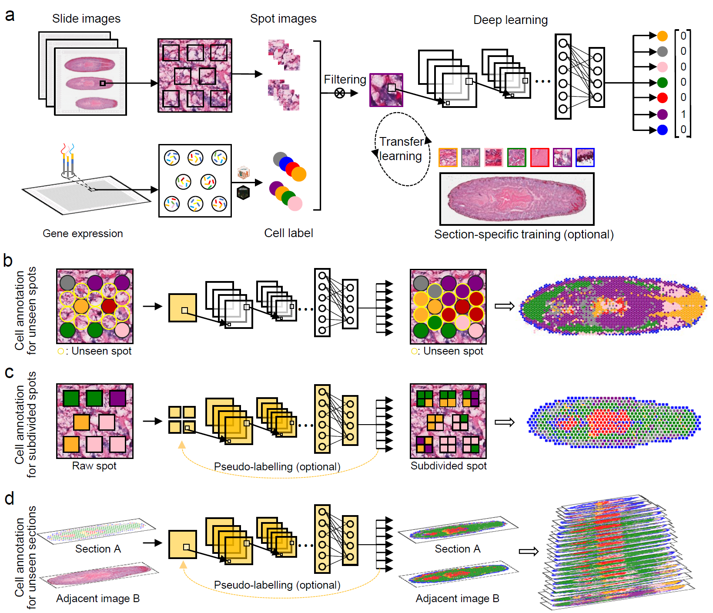

# STASCAN

## Overview
The development of spatial transcriptomics (ST) technologies has enabled the three-dimensional presentation of cellular distribution with differential gene expression profiles in tissue, but the limited spatial resolution still poses a challenge to acquire a fine-resolved cell map. Here we propose STASCAN, which both gene expression and the morphological information are simultaneously utilized to improve the cellular resolution of captured domains and even gap regions. Besides, STASCAN is further designed to enable cell-type predictions at subdivide-spot resolution and construction of the 3D spatial cell map from histology images alone. 

## Hardware dependencies
STASCAN can run on CPU-only hardware, but training new models will take exceedingly long.

We recommend running STASCAN on a GPU hardware.

## Software dependencies
tensorflow==2.9.0

numpy>=1.21.6

matplotlib>=3.5.3

cv2>=4.6.0

PIL>=6.2.0

tensorflow==2.9.0

sklearn>=1.0.2

skimage>=0.19.0

## Installation
pip install STASCAN==1.0.0

## Getting started

A guide to getting quickly started with STASCAN can be found [here.](./Demo/Demo1/demo1.ipynb)

A complete guide to run a multi-sections model with optional processes can be found [here.](./Demo/Demo2/demo2.ipynb)

## License
[MIT © Ying Wu.](./LICENSE.txt)

## Citation
